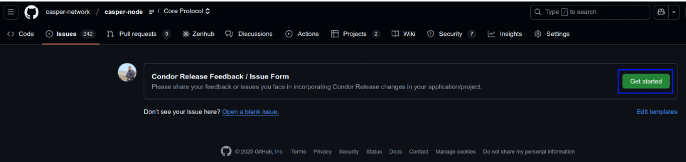

# Devnet Information

## What is Devnet?

The Casper Condor release is being rolled out in a phased fashion, allowing people to test their code, SDKs and smart contracts, before migrating to Mainnet. The first phase of this is rolling out to Devnet. 

This article/FAQ is a guide to the process for gaining access to Devnet, what to expect when you do access Devnet, and any other concerns.

## How can I access Devnet?

You can request access to Devnet using the provided form [here](https://forms.gle/NXYtoK7gPXB1iPP3A): 
 

Be sure to include a valid Casper public key in this form, which we will fund with CSPR tokens to allow you to test.

Once your request has been processed, you will be notified and provided with a list of IP addresses to which you can connect to DevNet.

## What is the latest commit/release candidate deployed on to the Devnet?

- Release Candidate: Condor/2.0.0 - RC6
- Commit Hash: `2178ad3aad9488076b38d8de467e6d1123f4b66b`
- Latest Devnet Release Date: 08-Jan-2025

## What are the Condor/2.0.0 Compatible branches/commits of downstream components?

**casper-sidecar:**
  - Release Candidate   : `release-1.0.0-rc5_node-2.0.0-rc6`
  - Branch/Repo : [casper-sidecar-release-1.0.0-rc5_node-2.0.0-rc6](https://github.com/casper-network/casper-sidecar/tree/release-1.0.0-rc5_node-2.0.0-rc6)

**casper-client-rs:**
  - Release Candidate   : `release-3.0.1-rc2_node-2.0.0-rc6`
  - Branch/Repo : [casper-client-release-3.0.1-rc2_node-2.0.0-rc6](https://github.com/casper-ecosystem/casper-client-rs/tree/release-3.0.1-rc2_node-2.0.0-rc6)

**NCTL:**
  - New NCTL image with `v200-rc6` available on Docker Hub: 
    - `makesoftware/casper-nctl:v200-rc6`

**CEP-18:** 
  - A version of CEP-18 compatible with Condor RC5/6 is available in the forked repository [here](https://github.com/davidatwhiletrue/cep18-limited/tree/casper-2.0.0-rc5)

  - Please note that this is meant for testing SDKs and scripts

**CEP-78:**
- Work in progress

**SDKs:**
- JavaScript/TypeScript
  - Github release  : [casper-js-sdk-v5.0.3-beta2](https://github.com/casper-ecosystem/casper-js-sdk/releases/tag/5.0.3-beta2)  
  - npm : [casper-js-sdk-v5.0.3-beta2](https://www.npmjs.com/package/casper-js-sdk/v/5.0.3-beta2)

- .NET
  - Github release  : [casper-net-sdk-v3.0.0-beta2](https://github.com/make-software/casper-net-sdk/releases/tag/v3.0.0-beta2)  
  - Nuget package   : [Casper.Network.SDK 3.0.0-beta2](https://www.nuget.org/packages/Casper.Network.SDK/3.0.0-beta2)  

- Go
  - Github release  : [casper-go-sdk-v2.0.0-beta2](https://github.com/make-software/casper-go-sdk/releases/tag/v2.0.0-beta2)  
- Java (WIP)
- Python (WIP)
- Rust (WIP)
- PHP (WIP)

NOTE: 
The SDKs have a couple of known serialisation issues. We're working on patch updates to address these issues.

## How can I explore the transactions in Devnet?

You can explore using the DevNet mini-explorer that points to the Devnet (RC6) at https://devnet.make.services/ 

Please note that SSE is listening at 52.90.123.125.

## How can I report a bug/issue when testing in Devnet?

Should you have any feedback, feature requests or face any issues or bugs, please file it using the GitHub Form [here](https://github.com/casper-network/casper-node/issues/new?assignees=devendran-m%2Cpiotr-dziubecki%2Csacherjj%2Ccspramit%2CSaiProServ&labels=condor-feedback&projects=&template=feedback.yml&title=%5BCondor-Release%5D%3A+Specify+your+feedback%2Fissue+briefly).

We appreciate you taking the time to file your feedback and/or issues/bugs. Please provide as much information as possible, especially in case of an issue or a bug. It would be advantageous for the team to conduct a comprehensive analysis and respond promptly.

Please refer to this [reference ticket](https://github.com/casper-network/casper-node/issues/4999) for information on providing all the required supporting information for a seamless analysis. 
