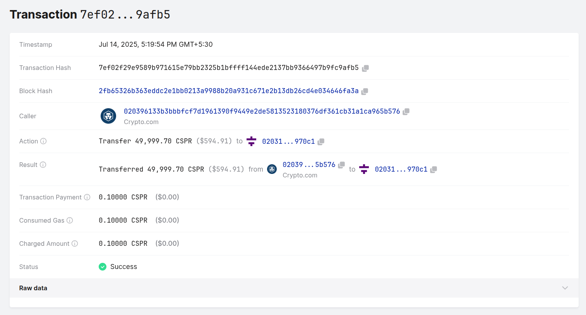

## Transactions in Casper v2.0

In this article we will examine user transactions (previously called deploys).  More specifically we will review the expanded set of transaction types and how they are processed by the node's execution engine.

<!-- truncate -->

## Transaction Types

Transactions encapsulate user intents.  For example, if Alice intends to transfer CSPR to Bob, she uses software (e.g. a wallet) to construct and sign a transaction that is subsequently dispatched to a trusted node for processing by the network.

Transactions may be either 'native' or 'WASM':

- Native transactions are those that interact with system contracts such as `mint` and/or `auction`.  They do not require any Web Assembly(WASM) payload to be constructed,  are normally compact in size, and are processed directly on the metal, i.e. host-side.

- Web Assembly(WASM) transactions are those that interact with the system via either on-chain smart contracts or session logic.  All such interactions are based upon user-defined WASM binaries, and are executed within one of the node's supported virtual machines.

In Casper 1.0 there was a single native transaction type (Transfer), and a set of WASM based transaction types (ContractByHash, ContractByHashVersioned, ContractByName, ContractByNameVersioned, ContractBytes). In Casper 2.0 the set of both native & WASM transaction types have been expanded.

Casper 2.0 Native Transaction Types:

|Type|Description|
|--------|---------------------------------|
| `add-bid` | To create a bid purse or or increase an existing bidder's bid amount |
| `activate-bid` | To reactivate an inactive bid |
| `withdraw-bid` | Used to decrease a validator's stake or remove their bid completely if the remaining stake is below the minimum required amount |
| `delegate` | Used to add a new delegator or increase an existing delegator's stake |
| `undelegate` | To reduce a delegator's stake or remove the delegator if the remaining stake is zero |
| `redelegate` | To reduce a delegator's stake or remove the delegator if the remaining stake is zero. After the unbonding delay, it will automatically delegate to a new validator |
| `transfer` | Used to reference motes from a source purse to a target purse |

Not all work is identical, e.g. a base token (cspr) transfer differs from a smart contract execution.  

Casper 1.0 supported a set of 6 transaction types, in Casper 2.0 the set is both refined and expanded.

The Transaction type has a number of changes from its predecessor, the Deploy. 

### Deploys and Transactions

The Deploy model is deprecated as of Casper 2.0, and support will be removed entirely in a future major release. However, Casper 2.0 will continue to accept valid Deploys and will attempt to execute them. For more details on Transactions, please refer to the Documentation section [here](https://docs.casper.network/concepts/transactions). 

## How to create a transaction

A transaction, such as transferring CSPR tokens from one user's purse to another, can be created and sent to the Casper Network for processing using any of three methods:

1. CSPR.Live
2. SDK [e.g JavaScript/TypeScript SDK]
3. Casper Client

### 1. CSPR.Live

You can transfer Casper tokens (CSPR) using any block explorer built to explore the Casper blockchain. The Wallet feature on these block explorers enables transfers to another user's purse, delegate stake, or undelegate stake.

[CSPR.Live](https://cspr.live/) is the main and recommended Casper block explorer. For detailed guidance, the [**Transferring Tokens**](https://docs.casper.network/users/token-transfer#transferring-tokens-1) page in the **Users** section of the documentation provides step-by-step instructions on how to transfer CSPR tokens using CSPR.live.

### 2. SDK

The following example demonstrates how to create and execute a native CSPR token transfer using the JavaScript SDK.  This walkthrough shows the complete process of constructing, signing, and submitting a transaction to the Casper Network.

#### 2.1. Initialize RPC client with network endpoint

This is to establish connection to a Casper node endpoint for network communication.

```js
const rpcHandler = new HttpHandler(ENDPOINT);
const rpcClient = new RpcClient(rpcHandler);
```

#### 2.2. Load sender's private key securely

This is to load the sender's private key from a secure file location using Ed25519 cryptography.

```js
const privateKey = getPrivateKey_ed25519(PRIVATE_KEY_PATH);
```

#### 2.3. Build transaction

Build transaction using `NativeTransferBuilder` with:
- Sender and recipient addresses
- Transfer amount (in motes: 1 CSPR = 1,000,000,000 motes)
- Unique transaction ID
- Network chain name
- Gas payment amount

**NOTE:** All amounts must be specified in motes (smallest CSPR unit)

```js
const transaction = new NativeTransferBuilder()
  .from(privateKey.publicKey)           // Sender's public key
  .target(PublicKey.fromHex('015ae...')) // Recipient's public key
  .amount('2500000000')                 // 2.5 CSPR in motes
  .id(Date.now())                       // Unique transaction ID
  .chainName(NETWORKNAME)               // Network identifier
  .payment(100_000_000)                 // Gas fee (0.1 CSPR)
  .build();
```


#### 2.4. Sign transaction with private key

The transaction built in the previous step is signed using the private key;

```js
transaction.sign(privateKey);
```

#### 2.5. Submit to network

In this step, the constructed transaction is submitted to the network;

```js
try {
  const result = await rpcClient.putTransaction(transaction);
  console.log(Transaction Hash: ${result.transactionHash});
} catch (e) {
  console.error(e);
}
```


#### 2.6. Receive transaction hash for tracking

A transaction hash will be returned , which the user can use it to verify the transaction in the Block Explorer like CSPR.Live

Below is a screenshot of an example Transfer [transaction](https://cspr.live/transaction/7ef02f29e9589b971615e79bb2325b1bffff144ede2137bb9366497b9fc9afb5) on the Mainnet;



In this example transaction `7ef02f29e9589b971615e79bb2325b1bffff144ede2137bb9366497b9fc9afb5`, 49, 999.60 CSPR has been transferred from `020396133b3bbbfcf7d1961390f9449e2de5813523180376df361cb31a1ca965b576` to `020312d2d4c4cac436b4c9bd0dc7eba4d129bf5eb05e02f731f7a89221d2fde970c1`

The "Raw Data" will give more details about the transaction.

### 3. Casper Client

A transaction can be initiated by using casper-client-rs CLI. Example V1 (2.0.0) and legacy transfers are given below with the clarity;

#### V1 

```sh
# Casper CLI command to transfer CSPR tokens
casper-client put-transaction transfer \
--target 010068920746ecf5870e18911ee1fc5db975e0e97fffcbbf52f5045ad6c9838d2f \
  # Recipient's public key (hexadecimal format)
  --transfer-amount 2500000000 \                                                      # Amount to transfer: 2.5 CSPR (in motes)
  --chain-name integration-test \                                                     # Network chain identifier , integration-test in this example
  --gas-price-tolerance 1 \                                                          # Gas price tolerance (multiplier)
  --secret-key path/to/secret_key.pem \                                 # Path to sender's private key file
  --payment-amount 100000000 \                                                       # Gas fee: 0.1 CSPR (in motes)
  --standard-payment true \                                                          # Use standard payment logic
  -n http://node.integration.casper.network:7777/rpc                                 # Network RPC endpoint URL
```


#### Legacy

```sh
# Casper CLI command to transfer CSPR tokens (legacy)

casper-client transfer \
--amount 2500000000 \  # Amount to transfer: 2.5 CSPR (in motes)
--target-account 010068920746ecf5870e18911ee1fc5db975e0e97fffcbbf52f5045ad6c9838d2f \  #Recipient's public key (hexadecimal format)
--transfer-id 123 \  #Unique transfer identifier (prevents replay attacks)
--secret-key path/to/secret_key.pem \  
#Path to sender's private key file (PEM format)
--chain-name integration-test \  #Network chain identifier , integration-test in this example
  --payment-amount 100000000 \  #Gas fee: 0.1 CSPR (in motes)
  -n http://node.integration.casper.network:7777/rpc 
  # Network RPC endpoint URL
```


### Delegate and Undelegate Tokens

CSPR token holders can earn rewards and participate in the protocol through a mechanism called delegation or [staking](https://docs.casper.network/concepts/economics/staking). 

If a user wants to undelegate tokens from their chosen validator, they can do so at any time. 

#### Delegate Tokens

The tutorial [**Delegating Tokens with a Block Explorer**](https://docs.casper.network/users/delegate-ui) covers in detail how a user can delegate their tokens.

#### Undelegate Tokens

In order to undelegate their already delegated token, user can follow the step-by-step guide in the [**Undelegating Tokens**](https://docs.casper.network/users/undelegate-ui) section. 