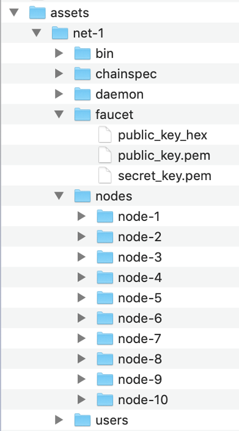
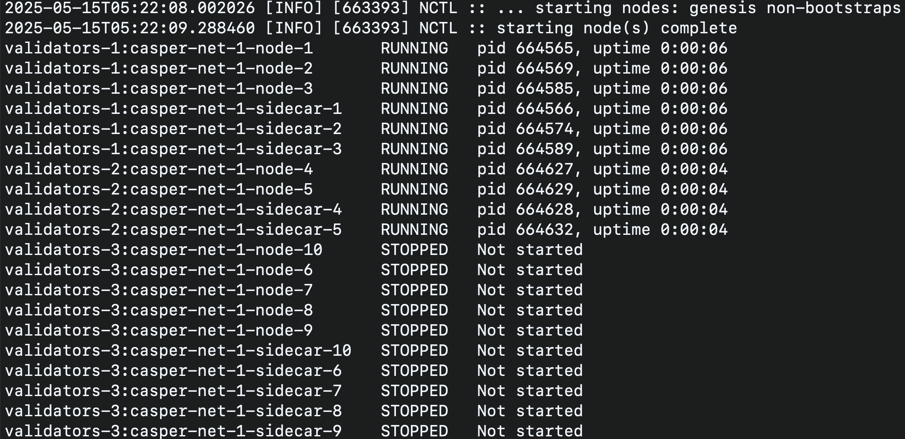

# Setting up a Local Network with NCTL


NCTL stands for network/node control. [NCTL](https://github.com/casper-network/casper-node/tree/master/utils/nctl) is a CLI application you can use to set up and control multiple local Casper nodes during development. Many developers wish to spin up relatively small test networks to localize their testing before deploying to the blockchain. Adopting a standardized approach in the community is also helpful for troubleshooting and reporting issues.

## Prerequisites {#prerequisites}

1.  You have completed the [Getting Started section](../../developers/writing-onchain-code/getting-started.md), which shows you how to install your development environment, including tools like _CMake_ (version 3.1.4+), _Cargo_, and _Rust_.
2.  Make sure you have [Python 3 installed](https://www.python.org/downloads/) if your operating system does not include Python.
3.  To run NCTL, you will also need [the bash shell](https://www.gnu.org/savannah-checkouts/gnu/bash/bash.html).

<!---TODO Video will need to be updated before making public again.

## Video Tutorial {#video-tutorial}

If you prefer a video walkthrough of this guide, you can check out this video.

<iframe width="560" height="315" src="https://www.youtube.com/embed?v=rE_saHopXXU&list=PL8oWxbJ-csEogSV-M0IPiofWP5I_dLji6&index=2" frameborder="0" allow="accelerometer; autoplay; clipboard-write; encrypted-media; gyroscope; picture-in-picture" allowfullscreen></iframe>

-->

## Installing a Virtual Environment {#installing-a-virtual-environment}

We will show you how to run NCTL in a virtual environment. If you want to run NCTL at the system level, you can, but we recommend that you only do that if you are sure you know what you are doing.

First, you will need to install a set of tools required for running NCTL.

**Step 1.** The first tool you will need is **pip**, a package manager for Python. Pip comes with the Python 3 installation from python.org, but if you do not have it already, follow the steps below or [the full installation instructions](https://pip.pypa.io/en/stable/installing/).

Instructions for MacOS:

```bash
$ curl https://bootstrap.pypa.io/get-pip.py -o get-pip.py
$ python3 get-pip.py
```

Instructions for Linux:

```bash
$ sudo apt install python3-pip
```

**Step 2.** Install **pkg-config**, a program used to compile and link against one or more libraries.

Instructions for MacOS:

```bash
$ brew install pkg-config
```

Instructions for Linux:

```bash
$ sudo apt install pkg-config
```

**Step 3.** Install either **libssl-dev** (Linux) or **openssl** (MacOS), which are toolkits for the Transport Layer Security (TLS) and Secure Sockets Layer (SSL) protocols. They also serve as general-purpose cryptography libraries.

Instructions for MacOS:

```bash
$ brew install openssl
```

Instructions for Linux:

```bash
$ sudo apt install libssl-dev
```

**Step 4.** You will also need the **gcc** and **g++** compilers, which usually come as part of developer command-line tools (versions 7.5.0 at the time of this writing).

Instructions for MacOS:

```bash
$ xcode-select --install
$ gcc --version
$ g++ --version
```

Instructions for Linux:

```bash
$ sudo apt install build-essential
$ gcc --version
$ g++ --version
```

**Step 5.** Create and activate a new virtual environment. **Commands applicable to the virtual environment will be prefixed with (env)**. Run the following commands to set it up.

Instructions for MacOS and Linux:

```bash
$ python3 -m venv env
$ source env/bin/activate
(env) $
```

**Step 6.** Inside the virtual environment, upgrade **pip** to the latest version.

Instructions for MacOS and Linux:

```bash
(env) $ pip install --upgrade pip
```

**Step 7.** Install **jq**, a command-line JSON processor.

Instructions for MacOS and Linux:

```bash
(env) $ pip install jq
```

**Step 8.** Install **supervisor**, a cross-platform process manager.

Instructions for MacOS and Linux:

```bash
(env) $ pip install supervisor
```

**Step 9.** Install **toml**, a configuration file parser.

Instructions for MacOS and Linux:

```bash
(env) $ pip install toml
```

## Setting up the Network {#setting-up-the-network}

You are now ready to set up and run your local network of Casper nodes.

:::note

NCTL will not work properly if the following repositories are downloaded via Github's web GUI. To ensure functionality, use the CLI `git clone` command.

:::

**Step 10.** Clone the _casper-nctl_ software in your working directory, referenced here as _WORKING_DIRECTORY_. **Very Important!!! Choose a short path for your working directory**; otherwise, the NCTL tool will report that the path is too long.

Instructions for MacOS and Linux:

```bash
$ cd <WORKING_DIRECTORY>
$ git clone https://github.com/casper-network/casper-nctl
```

**Step 11.** Clone the _casper-node_ software in your working directory.

Instructions for MacOS and Linux:

```bash
$ git clone https://github.com/casper-network/casper-node
```

**Step 12.** Clone the _casper-client-rs_ software in your working directory.

Instructions for MacOS and Linux:

```bash
$ git clone https://github.com/casper-ecosystem/casper-client-rs
```

**Step 13.** Clone the _casper-node-launcher_ software in your working directory.

Instructions for MacOS and Linux:

```bash
$ git clone https://github.com/casper-network/casper-node-launcher
```

:::note

Assuming you have set up a small local network, you can speed up the process of creating new blocks with NCTL by reducing the `deploy_delay` in your [local config.toml](https://github.com/casper-network/casper-node/blob/dev/resources/local/config.toml#L390) before running `nctl-assets-setup`.

:::

**Step 14.** Clone the _casper-sidecar_ software in your working directory. As part of Casper 2.0 release, the sidecar is now necessary to interact with a Casper network and will handle any API requests.

Instructions for MacOS and Linux:

```bash
$ git clone https://github.com/casper-network/casper-sidecar
```

**Step 15.** You may need to extend your `.bashrc` file to make NCTL commands available from the terminal session. You can do so using the following commands:

```bash
cd YOUR_WORKING_DIRECTORY/casper-nctl

cat >> $HOME/.bashrc <<- EOM

# ----------------------------------------------------------------------
# CASPER - NCTL
# ----------------------------------------------------------------------

# Activate NCTL shell.
. $(pwd)/activate

EOM
```

Followed by refreshing the bash session:

```bash
. $HOME/.bashrc
```

**Step 16.** Activate the NCTL environment with the following command.

Instructions for MacOS and Linux:

```bash
$ source casper-node/utils/nctl/activate
```

**Step 17.** Compile the NCTL binary scripts. The following command compiles both the _casper-node_ and the _casper-client_ in release mode.

Instructions for MacOS and Linux:

```bash
$ nctl-compile
```

:::note

The compilation takes some time, so it might be a perfect moment to get some coffee.

:::

**Step 18.** Set up all the assets required to run a local network, including binaries, chainspec, config, faucet, and keys. Also, spin up the network right after. The default network will have 10 nodes and 10 instances of the sidecar, with 5 active nodes and sidecars and 5 inactive nodes and sidecars.

Instructions for MacOS and Linux:

```bash
$ nctl-assets-setup && nctl-start
```

Once a network is up and running, you can control each node within the network and add new nodes to the network.

Several other NCTL commands are available via aliases for execution from within a terminal session. All such commands are prefixed by _nctl-_ and allow you to perform various tasks.

You should see the new directory _utils/nctl/assets_, with the following structure.



Here is the command line output you would expect.



## Stopping the Network {#stopping-the-network}

**Step 19.** Although not necessary, you can stop and clean the NCTL setup with the following commands.

Instructions for MacOS and Linux:

```bash
$ nctl-stop
$ nctl-clean
```

## Next Steps {#next-steps}

1.  Explore the [various NCTL commands](https://github.com/casper-network/casper-node/blob/master/utils/nctl/docs/commands.md).
2.  Explore the [NCTL usage guide](https://github.com/casper-network/casper-node/blob/master/utils/nctl/docs/usage.md).
