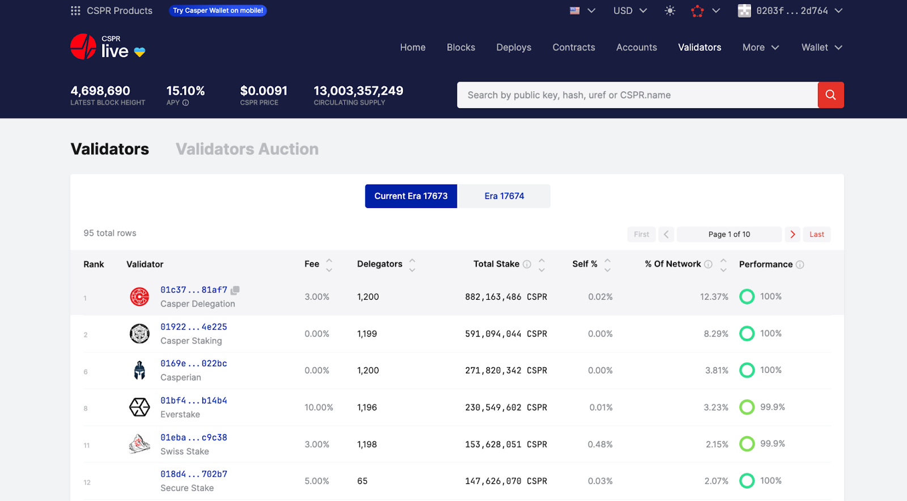

# Delegating Tokens

Casper is a proof-of-stake blockchain, which means CSPR holders can earn rewards by staking their tokens with validators. This process is called delegation, a form of staking, and allows you to participate in securing the network without running a validator node yourself.

You maintain custody of your tokens. The validator never controls your funds. Instead, you delegate your stake to a validator of your choice, and you earn a share of their rewards.  
  
  

## Selecting a Node for Delegating

  

It is essential to select a validating node that you can trust.

  

Block explorers such as [CSPR.live](https://cspr.live/) provide [validator performance statistics](https://cspr.live/validators), including a performance score, total stake, number of delegators, and fees. Please do your due diligence before staking tokens with a validator.

## What’s New with Delegation in Casper 2.0

Casper 2.0 introduced Zug Consensus, a major upgrade that changed how validator rewards (and therefore delegator rewards) are calculated.

Under the previous consensus model (Highway), rewards were distributed based on network-wide participation. If even one large validator underperformed, it could lower the rewards of every other validator and their delegators.

Under Zug, this is no longer the case. Now validator rewards are now individualized per block. Each validator earns rewards based on their own actions, specifically:

•  Block proposals

•  Finality signature creation

•  Finality signature publication

Poor performance affects only that validator. If a validator misses blocks or doesn’t publish signatures, they simply earn less. It does not impact others. Delegators are rewarded proportionally to their validator’s performance.

If you’re seeing lower rewards, it no longer means the whole network is underperforming, it likely means your validator didn’t reach full participation in that era (an era equals 2 hours).

**Rewards now fluctuate by design.**

Under Highway, rewards were stable. Delegators received the same amount per era. Under Zug, rewards can vary up to ~20% per era on mid to large size validators, depending on validator activity. The fluctuations in rewards may be higher on lower-weight validators.

Note that this variability is intentional. It creates stronger incentives for validators to consistently participate and boosts the network’s long-term security.

Over time, as validator behavior stabilizes, these fluctuations are expected to narrow.

For a deeper explanation of how the Casper 2.0 reward system works, read: [Validator Rewards in Casper 2.0](https://docs.casper.network/condor/validator-rewards)

You can always check live validator performance and estimated rewards at [CSPR.live](https://cspr.live). The explorer has been updated to reflect Casper 2.0’s reward logic.

## Why You Should Delegate Your CSPR & Things to Consider Before Choosing a Validator

Casper is a Proof-of-Stake blockchain, meaning the network is secured, governed, and maintained by validators, and the delegators who support them.

When you delegate your CSPR tokens to a validator, you are not only earning rewards, but you are also actively participating in the security and governance of the Casper blockchain.

Validators participate in on-chain governance votes, and by delegating to them, you are indirectly expressing your voice on network decisions.

### What to Look for When Choosing a Validator

Before delegating your tokens via [CSPR.live](https://cspr.live), here are the key metrics you should pay attention to:

1. Validator Performance

Check their performance score. This score shows how consistently the validator participates in block production and finality, which directly affects your staking rewards.  
  
The performance indicator is based on on-chain metrics and conveys each validator’s success at consensus participation, as measured over the last 360 eras, which is approximately equal to a 30-day time frame. A validator that performed perfectly the last 360 eras, will have a 100% score. (Please note that it is very hard to achieve 100% due to the nature of distributed systems, and a performance value over 99% is considered excellent.)

2. Commission Fee

Each validator sets a commission rate — a percentage deducted from the staking rewards earned by delegators. This fee helps cover the validator’s operational costs and incentivizes their continued participation in securing the network. Reasonable commission rates are essential to maintaining a reliable, decentralized, and sustainable validator ecosystem.

3. Total Stake and Decentralization

Avoid delegating only to the top validators with very large stakes. Decentralization matters.

Supporting smaller but high-performing validators helps keep the network healthy and decentralized.

4. Validator’s Governance Participation

Validators vote on-chain on protocol-level decisions. Delegating to a validator means you trust them to represent your interests on the network. If you care about how the network evolves, this matters.

5. Validator Minimum Stake Requirements

Some validators set a custom minimum delegation amount (e.g., 1,000 CSPR). Make sure to check this before delegating.

6. Support Channels

It’s recommended to choose a validator that will be available for questions or support when needed.

----------

## Monitoring Your Stake

With Zug, rewards are now more directly tied to validator output. Check periodically to make sure your validator is still active and performing well.

If your validator stops producing blocks or unbonds, your rewards will stop, and you may need to redelegate once the unbonding period is over.

You can monitor your staking performance via [CSPR.live](https://cspr.live) or any updated block explorer.

## Minimum Stake Amounts and Enforcement

Casper 2.0 enforces a protocol-level minimum delegation amount of 500 CSPR. Any delegation below this amount will be rejected. This change aims to prevent inactive or negligible delegations from occupying validator slots, which are limited to 1,200 per validator.

Additionally, validators can now define their own minimum acceptable delegation amount. A validator may choose to only accept delegations of 1,000 CSPR or more.

If you attempt to delegate below a validator’s custom minimum, the transaction will not succeed.

The entire delegation will be automatically undelegated if the remaining delegated amount drops below the validator's minimum stake threshold, which can be 500 CSPR or above, based on the validator's config.

Note: Always leave enough staked to stay above the minimum enforcement level. If you’re unsure what the validator’s minimum is, check their listing on [CSPR.live](https://cspr.live/validators).

## FAQ

### How often do I get staking rewards?

You get staking rewards every 2 hours. This is called an "Era". After you stake your tokens, your first reward may take up to 4 hours (2 Eras) to show up.

### I’ve staked my tokens but don’t see any rewards. What’s wrong?

That’s normal at first. Rewards don’t go directly to your wallet. They’re added to your existing stake with the validator. You can see them under the Rewards tab on [CSPR.live](https://cspr.live). It may take up to 6 hours (3 Eras) for the first rewards to appear.

### Is there a lock-up period after I stake my tokens?

No, your tokens aren’t locked when you stake. You can undelegate them anytime. But after undelegating, you’ll need to wait about 14 hours (7 Eras) for your tokens to become available again.

### Can I lose my tokens while staking?

Currently, no, slashing is not enabled on the Casper Mainnet, and there are no plans to enable it in the near future. If a validator behaves poorly on the network, they may be evicted from the auction, and you will not earn rewards during the period that the validator is evicted. If slashing is ever enabled in the future—which would require approval through a governance vote—tokens could be removed as a penalty for poor or malicious behavior on the network. In that case, you could lose tokens delegated to that validator.

### How much does it cost to stake and unstake?

To stake, you need 2.5 extra CSPR in your wallet (for network fees). To unstake, the cost is 2.5 CSPR as well.

### How much can I earn from staking?

Right now, the average yearly return is around 15%. This can change over time as more people stake. The base reward rate is 8% of the total token supply, but since not everyone stakes, those who do earn a higher percentage.

### What does a 100% commission rate mean for a validator?

It means the validator keeps all the rewards. If you stake with them, you will earn nothing. These validators usually don’t want to offer staking services or are not allowed to.

## Tutorials

Navigate to these pages for step-by-step tutorials on delegating and undelegating tokens.

- [Delegating tokens using a block explorer](./csprlive/delegate-ui.md)
- [Delegating with Ledger devices](./ledger/staking-ledger.md)
- [Delegating with the Casper client](../developers/cli/delegate.md)
- [Undelegating tokens using a block explorer](./csprlive/undelegate-ui.md)
