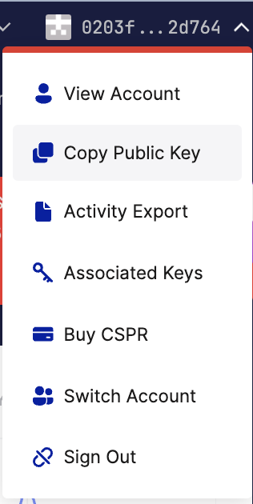

# Funding Your Casper Account

Your Casper account is your personal address on the Casper blockchain. It’s identified by a public key, which you can use to receive CSPR tokens or interact with Casper smart contracts.

There are several ways to fund your Casper account. This guide covers the most common methods and what you should know before using them.

## Purchase via CSPR.live

You can easily purchase CSPR tokens via [CSPR.live](https://cspr.live).

1. From the top right corner, connect your Casper Wallet, MetaMask, or Ledger account. Once your public key appears, select "Buy CSPR".

2. Specify the amount and the currency you’d like to use and select "Next."

3. Select your preferred On-ramp provider, and you will be directed to their platform.

4. Follow the instructions of the on-ramp provider.

## Purchase via Casper Wallet

1. After unlocking your wallet, select "Buy".

2. Select your recipient account and specify your country.

3. Then, specify the amount and the currency you’d like to use and select "Next."

4. Select your preferred On-ramp provider, and you will be directed to their platform.

5. Follow the instructions of the on-ramp provider.

## Funding from a Centralized Exchange

You can buy CSPR tokens on a centralized exchange (CEX) and withdraw them to your Casper account. Here is an example using KuCoin.

> Note: Page names and buttons may vary from platform to platform. For example, on KuCoin the wallet is called a "Funding Account," while other platforms may label it "Spot Wallet" or simply "Wallet".

Before starting, copy the public key where you wish to transfer funds.

You can copy it from your account on [CSPR.live](https://cspr.live) if you connected your Casper Wallet.

You can also copy your public key directly from your Casper Wallet.

### Transfers from KuCoin to Casper Mainnet

We recommend trying these steps with a small amount of CSPR first.

1. Log in to your KuCoin account.
2. From the "Assets" menu, select "Funding Account".

3. Find CSPR and select "Withdraw".

4. Enter your public key (wallet address), select "Casper Network," and specify the amount.

5. Click "Withdraw," then review and confirm your withdrawal.

> Note: Transaction time may vary depending on the CEX you are using.

### Things to Keep in Mind

* Only use your **public key**. Never share your **private key** or **recovery phrase**.
* Always double-check the address. Blockchain transactions are **irreversible**.
* Confirm network type. Withdraw **only to Casper Mainnet**, not to an EVM chain or unsupported network.

## Funding from a Decentralized Exchange (DEX)

You **cannot** directly fund your Casper account from a DEX if your account does not already hold any CSPR tokens. All transactions on the Casper blockchain require CSPR for gas fees.

If this is your first time funding your Casper account, you must first acquire CSPR from a CEX, CSPR.live, or Casper Wallet.

### Prerequisites

To fund your account via a DEX like [Friendly Market](https://www.friendly.market/swap):

* You must have a Casper Wallet already set up.
* Your wallet must contain some CSPR tokens for gas fees.
* You must also have another supported Casper-native token (e.g., dUSDC) to swap.

### Steps:

1. Go to [Friendly Market](https://www.friendly.market/swap)
2. Click "Connect Wallet" and approve the connection using Casper Wallet.
3. Choose the token you want to swap (e.g., dUSDC, dUSDT, Fatso).

> Note: Friendly Market supports swaps only between tokens available on the Casper network.

4. Input the amount you want to swap.
5. Click "Swap." Sign the transaction with your wallet.
6. After a few seconds, your wallet balance will reflect the new amount of CSPR.

> Note: The transaction will not succeed if you don’t have sufficient tokens to pay for gas.
